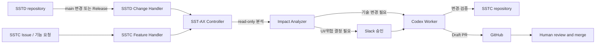

# SST-AX 아키텍처

## 목적

SST-AX는 SSTD(Server State Telemetry Demon)의 변경을 분석하고, 필요한 경우 SSTC(Server State Telemetry Client)에 반영하기 위한 자동화 제어 영역이다. AI는 구현을 지원하지만 아키텍처, 프로토콜, 보안, UI 정책, 병합과 릴리즈의 최종 책임은 사람에게 있다.

## 전체 구조



## 구성 요소

| 구성 요소 | 책임 | 초기 권한 |
|---|---|---|
| SSTD | 서버 데몬, 프로토콜 원천 구현 | AX read-only |
| SSTC | Android 모바일 클라이언트 | AX branch write, Draft PR |
| SST-AX Controller | 트리거, 상태, 승인, GitHub 작업 조정 | 별도 서비스 계정 |
| Impact Analyzer | SSTD 변경과 SSTC 영향 분석 | read-only |
| Codex Worker | 승인된 범위의 SSTC 수정·검증 | 전용 workspace |
| Slack Gateway | 승인 요청, 일일 보고, 서명 검증 | 승인 명령만 전달 |

## Controller 진입점

SST-AX Controller는 변경 출처에 따라 두 개의 논리적 Handler를 제공한다. 초기에는 하나의 Controller 프로세스 안에서 구현하며, 별도 서비스로 분리하지 않는다.

| Handler | 입력 | 목적 |
|---|---|---|
| `SSTD Change Handler` | SSTD main 변경, Release, protocol contract 변경 | SSTC 동기화 영향 분석 및 유지보수 PR |
| `SSTC Feature Handler` | GitHub Issue, 기능 요청, 버그 리포트 | SSTC 자체 기능 개발 및 Draft PR |

두 Handler는 Task 생성 이후 위험도 분석, Slack 승인, Codex 실행, 검증, Draft PR, 일일 보고를 공유한다. 작업량과 권한 경계가 커질 때만 Handler별 Worker 분리를 검토한다.

Slack 일일 보고는 자동화 실행 결과를 전달하는 운영 알림 기능이다. 보고 기능이 추가되어도 AI의 코드 변경·merge·Release 권한은 확대되지 않는다.

## Slack 보고 흐름

```text
Controller / Report Generator
        ↓
일일 실행 결과 집계
        ↓
민감 정보 제거·중복 확인
        ↓
Slack 운영 채널 게시
```

승인 요청은 즉시 전송하고, 일일 보고는 정해진 주기에 요약 전송한다. 두 메시지는 목적과 처리 규칙을 분리한다.

## 설계 원칙

Task 상태는 [`Task 상태 규약`](task-state.md)을 단일 설명 기준으로 사용한다. JSON Schema는 기계 검증 계약이고, 상태 전이 구현은 해당 규약과 함께 변경한다.

1. **Human ownership:** 프로토콜·보안·UI 정책·merge·release·production 배포는 사람이 결정한다.
2. **Bounded autonomy:** AI의 실행 권한보다 금지 영역을 먼저 정의한다.
3. **Single source of truth:** machine-readable contract, ADR, 요구사항, 코드 순서로 참조한다.
4. **Auditability:** 입력 commit/release, 영향 분석, 변경 파일, 검증 결과, 승인 결과, PR을 남긴다.
5. **Small steps:** 분석 → 승인 → 구현 → 검증 → Draft PR 순서로 작업한다.

## 현재 기준선

- SSTD는 C++17/CMake/Linux 프로젝트이며 실행 파일은 `sstd`이다.
- SSTD CI/CD는 GitHub Actions의 테스트·빌드·Release와 Jenkins의 Release 배포로 운영 검증되었다.
- 기존 SSTC가 SSTD 데이터를 정상적으로 수신하는 것까지 확인되었다.
- SST-AX는 SSTD/SSTC와 분리된 저장소로 구성하기로 결정했다.
- SST-AX Controller, OCI 상주 Worker, Slack Gateway, 자동 SSTC 동기화는 아직 구현 전이다.

## 도입 단계

```text
1. 수동 Codex 실행
2. 반복 절차의 Skill화
3. codex exec 기반 분석 자동화
4. SSTD 변경 영향 분석
5. SSTC 수정 및 Draft PR 생성
6. 검증된 저위험 작업만 제한적 unattended 실행
```

## ADR 운영

다음 결정은 `docs/adr/`에 ADR로 기록한다.

- 프로토콜 버전 및 호환성 정책
- 인증·암호화·replay protection
- Agent 권한과 승인 경계
- 상태 저장 위치와 보존 정책
- SSTC UI 정보 구조
- 외부 dependency 도입
