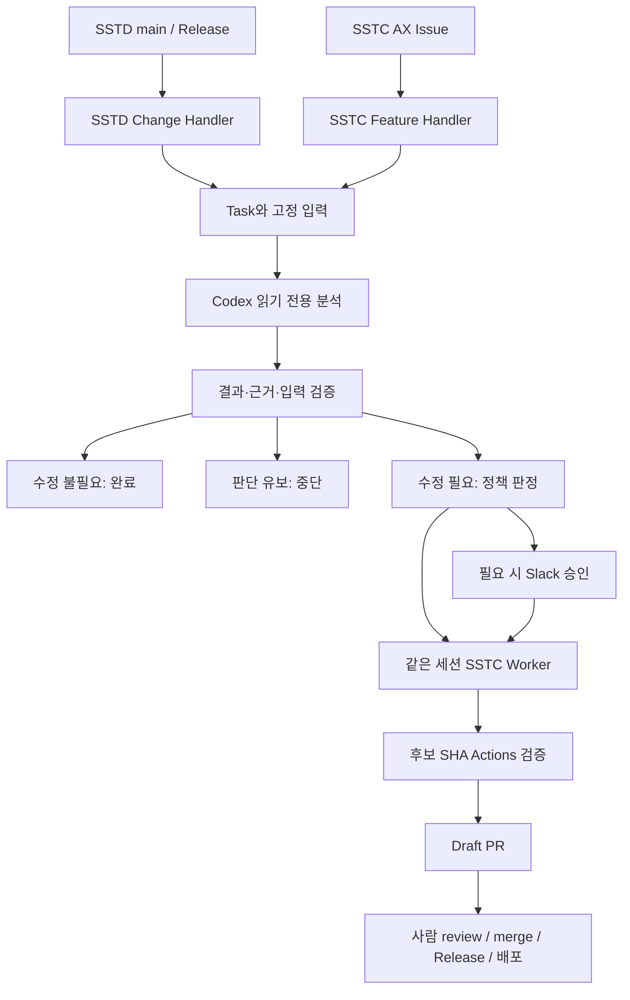

# SST-AX 아키텍처

목표는 SSTD 변경의 SSTC 영향을 자동으로 판단하고 필요한 수정을 검증하여 Draft PR로 전달하는 것입니다. 독립 SSTC UI/UX 요청도 같은 Task 실행 흐름을 사용합니다. 자동 입력·문맥 수집·결과에 따른 분기는 기본 범위입니다.

| 구성 | 역할 | 권한 |
|---|---|---|
| Controller | GitHub polling·중복 방지·Task 분기·재개 | 상태·SSTC 후보·Draft PR |
| SSTD Change Handler | cursor와 main/Release의 고정 범위 수집 | SSTD read-only |
| SSTC Feature Handler | `[AX]` Issue 본문 snapshot | 입력 read-only |
| Analyzer | diff·decoder/model/단위/UI 근거 분석 | 도구 없는 읽기 전용 |
| 실행 정책 | 분석·위험도·승인·세션 결합 판정 | 실행 근거 생성·재검증 |
| Worker | 허용 범위의 SSTC 구현 | 격리 worktree |
| Slack Gateway | 검증된 분석 표시·승인 결정 저장 | 승인 전이만 |
| GitHub Sensor / publisher | 고정 후보 검증·receipt·Draft PR | 토픽 branch·Actions·Draft PR |

두 Handler는 하나의 Controller에서 동작합니다. 파일 상태·입력 journal·Task별 OS 잠금을 사용하며 DB·외부 큐를 추가하지 않습니다. source는 commit SHA에 고정하고 미커밋 변경을 읽거나 덮어쓰지 않습니다.

SSTD 계약 변경은 이미 존재하는 commit이 입력입니다. 승인된 SSTC decoder/model/단위/UI 적응은 허용하지만 SSTD를 수정하지 않습니다. SSTC 요청에 새 SSTD 계약이 필요하면 중단합니다. 상한 내 문맥 수집은 의미적 충분성의 증명이 아니며 누락·UNKNOWN은 수정 불필요로 처리하지 않습니다.

승인 checkpoint와 감사 기록, 입력·결과·세션을 묶은 실행 근거는 보존합니다. 재시도·예산·작업 공간 상태는 별도 실행 checkpoint에 기록합니다. 구현 지침과 검증의 소유자는 SSTC이며, 후보 SHA·workflow·run attempt·artifact가 일치해야 Draft PR을 만듭니다.

자동 종료는 `COMPLETED` 또는 Draft PR의 `READY_FOR_REVIEW`입니다. [Controller](controller.md), [승인](approval-workflow.md), [복구](operations.md)를 함께 따릅니다.
