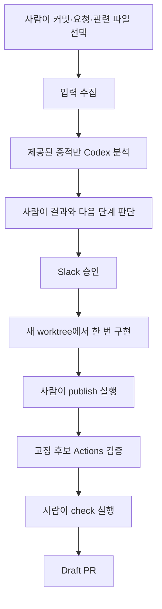

# 원래 목표 대비 구현 감사

감사일: 2026-10-06. 개발 Task: `sstc-feature-20261006-0002`.
이 문서는 읽기 전용 감사 결과와 수정 제안이다. 런타임 코드와 정책은 변경하지 않았다.

> 위 문장은 감사 당시 기준이다. 후속 교정 Task `sstc-feature-20261006-0003`의
> 구현은 자동 Controller, 실행 권한·재개, 승인 표시, 의미 검증을 연결한다.
> 현재 동작은 [Controller](controller.md)와 코드, 실제 검증 결과를 기준으로 한다.

## 후속 교정 범위와 남은 검증

아래는 감사 항목별 교정 위치다. 원래 목표의 완료 여부는 코드 추가와 운영 검증을 구분하여 판단한다.

| 감사 항목 | 교정 | 운영에서 확인할 내용 |
|---|---|---|
| 두 입력 자동 접수 | Controller의 SSTD main·새 Release, SSTC `[AX]` Issue 조회와 cursor·중복 방지 | OCI에서 두 입력의 실제 자동 접수 |
| 수동 문맥 선택 | 고정 SHA의 Android 소스·테스트·지침·CI와 SSTD 변경·계약 문맥 자동 수집 | 실제 변경의 문맥 충분성과 AI 판단 |
| 분석 후 분기 | 결과를 재검증하여 영향 없음 종료·판단 유보 중단·정책 실행·조건부 승인 | 실제 무영향·영향 사례의 분기 |
| 승인과 작업 범위 | 불변 실행 근거, 저위험 정책 허용, 승인된 SSTD 계약에 대한 SSTC 적응 | Slack 승인·거절과 후보 수정 범위 |
| 동일 작업 재개 | 세션·원본 승인·worktree·diff·누적 예산 검증, 관측한 reset 이후 재개 | 기존 OCI UI Task의 원본 기록·실행량 확인 |
| 승인 판단 자료 | 검증된 분석 요약·출처·영향·사유·질문 표시 | 실제 Slack 메시지와 결정 |
| 의미 검증 | 실제 SSTD C++ 패킷 기반 SSTC decoder·단위 테스트, 사람이 정한 영향 평가 사례 | 후보 Actions 전체 성공과 실제 AI 평가 실행 |
| 예산·대상 지침·문서 | 공유 누적 예산, 고정 지침·CI receipt, 기본 완료 기준에 맞춘 문서 | 실행 계정·권한 분리와 장시간 운영 |

SST-AX 회귀의 외부 Codex·GitHub·Slack 응답은 fake다. SSTC의 로컬 formatter 테스트와 C++ fixture 대조만으로 Android 전체 검증이나 무인 운영을 통과했다고 기록하지 않는다. Draft PR 게시와 고정 후보 Actions, OCI 운영 확인은 각각 증거가 확보된 뒤 완료로 판단한다.

## 판단

원래 설계는 유지돼 있지만, 구현은 **사람이 연결하는 안전한 CLI 부품과 Slack 승인 후 SSTC를 수정하는 경로**에 집중됐다. 제품의 핵심인 **두 입력의 자동 수신, 관련 코드 탐색, 영향 판정에 따른 실행, 저장 상태에서의 구현 재개**는 완성되지 않았다.

전체 재작성은 필요하지 않다. 수집·JSON 검증·세션 연결·Slack 인증·원격 빌드·후보/PR 검증은 보존하고, 앞단 Controller와 실행 권한·복구 연결을 수정해야 한다. 원격 Android 빌드 도입은 적절했다. 이를 원래 제품의 완성으로 판단한 것이 잘못이었다.

## 감사 기준과 증거

| 저장소 | 확인한 main |
|---|---|
| SST_AX | `449dbbdc8b83f41570bf32e21a82cfbf92e5899a` — PR #14 병합 |
| SSTD | `08f917cf853785cf026c6c32f7af244097ba3a15` |
| SSTC | `2dd38fa6d8f0164f8c37d1e4c18984eccd20ad60` |

SST_AX main의 tree `3832b97a91eb0bee18b7bbace334c0a04a0fb95f`는 검토한 로컬 `14eb7b8`의 tree와 동일하다. 원본 workspace의 미커밋 README는 보존했다.

원래 목표는 [아키텍처](architecture.md), [승인 흐름](approval-workflow.md), 사용자의 명시적 설명을 기준으로 했다.

- SSTD 변경을 자동 수신하고 SSTC protocol/parser/model/단위/수치/UI 영향을 판단한다.
- 영향이 없으면 근거를 기록하고 종료한다. 수정이 필요하면 정책상 필요한 승인을 거쳐 구현·검증·Draft PR까지 자동으로 진행한다.
- SSTD와 별개인 UI/UX 요청 창구를 제공하고 공통 실행 경로를 사용한다.
- 승인·거절, 사용량 제한, 복구, main/merge/Release/운영 배포 금지 경계를 유지한다.

현재 가능한 흐름은 다음과 같다. 각 단계 사이를 운영자가 실행한다.

## 어디서부터 어긋났는가

| 시점 | 사실 | 평가 |
|---|---|---|
| 초기 계획 | `SST_AX_Codex_CLI_Architecture_Plan.md`의 구현 로드맵에서 두 입력 Handler가 10번, 일일 보고가 9번이다. 아키텍처에는 처음부터 두 진입점과 공통 Controller가 있다. | 핵심 자동 입력 연결을 너무 뒤로 미룬 우선순위 문제다. 문서의 목표가 바뀐 것은 아니다. |
| PR #2–#9 | Task, 상태/저장 복구, SSTD/SSTC 결과 규약, 수동 입력 수집, Slack, 읽기 전용 Codex 연결을 순차 구현했다. | 필요한 기반이다. 독립 CLI PoC의 통과를 제품 전체 진행도로 판단하면 안 됐다. |
| PR #10 | `approved_session()`을 모든 Worker 실행에 사용하고, 새 worktree만 허용하며, 모든 protocol 변경을 금지하는 prompt와 로컬 Gradle 명령을 고정했다. | 코드상의 뚜렷한 분기점이다. 조건부 승인·SSTD 계약 대응·중단 상태 재개가 Slack 승인된 단발 기능 작업에 맞춰졌다. |
| PR #11–#13 및 SSTD/SSTC CI 변경 | Python 호환성, Slack 실행 편의, 수동 Release/배포 분리, 원격 빌드 Sensor를 구현했다. | 실제 장애와 별도 합의 범위를 해결한 변경이다. SSTD→SST_AX 자동 입력 연결을 구현한 것은 아니다. 롤백할 이유가 없다. |
| PR #14 | Worker 이후 후보 게시·Actions·Draft PR을 연결했지만 Slack 전용 실행 조건을 이어받았다. README는 입력 자동 연결을 후속 범위로 분류한다. | 후반부 연결은 유효하다. 앞단과 자동 실행 Controller가 없는 상태에서 목표 완료선을 SSTC CLI 경로로 좁힌 판단이 잘못됐다. |

## 기능별 공백과 수정 범위

### 1. 두 입력이 자동으로 작업을 시작하지 않는다 — 필수

`create_task.py:58,125`는 사람이 출처와 참조를 주는 로컬 CLI다. `docs/impact-inputs.md:16`은 Issue 자동 수집을 하지 않는다고 명시한다. SSTD의 현재 `ci.yml`과 `release.yml`에도 SST_AX 호출은 없다. 외부에 별도 webhook이 설정돼 있는지는 이 감사로 확인하지 못했다.

**수정:** 하나의 작은 Controller에 SSTD 변경 Handler와 SSTC 요청 Handler를 연결한다. 커밋/요청 snapshot, 처리 cursor, 이벤트 중복 식별을 저장하고 기존 Task 생성 함수를 재사용한다. 승인 후 재개와 Actions 완료 확인도 Controller가 담당한다.

서버·큐·DB를 별도로 만들 필요는 없다. 입력 수신은 주기 조회와 webhook 두 방식이 가능하다. 개인 OCI 환경에서는 단일 Controller의 주기 조회가 수신 서버·서명 endpoint 없이 시작할 수 있어 우선 제안한다. 수신 방식과 주기는 구현 전에 확정한다.

### 2. 탐색을 AI에 맡기는 목표가 수동 파일 선택으로 남았다 — 필수

`collect_impact_inputs.py:30,34`는 SSTC 문맥과 SSTD 경로를 직접 지정하게 한다. `impact_collection.py:242`는 변경 목록을 얻지만 선택에서 빠진 파일을 검사하는 용도다. `codex_impact.py:287,289`는 제공된 증적만 분석하고 도구 실행을 금지한다.

**수정:** Controller가 SSTD 변경 파일과 고정 SSTC revision의 decoder→model→repository/ViewModel→단위 변환/화면 참조를 수집한다. 필요하면 제한된 읽기 전용 탐색으로 문맥을 보강한다. 기존 수집기의 고정 SHA·해시·크기·누락 검사는 유지한다. 누락·판단 유보를 영향 없음으로 처리하지 않는다. 처음에는 실제 SSTD/SSTC 구조의 연결부터 다루고 범용 코드 검색 서비스를 만들지 않는다.

### 3. 영향 판정 후 자동 종료·승인·실행 분기가 없다 — 필수

`codex_impact.py:348–378`의 정상 결과는 `VALID`를 기록하지만 Task의 상태·위험도를 자동 분기하지 않는다. `NOT_REQUIRED`가 자동 `COMPLETED`로 이어지지 않으며, `REQUIRED`도 승인/구현 실행을 시작하지 않는다.

**수정:** 검증된 입력·결과 receipt를 다시 확인하는 Controller 판단을 추가한다. `NOT_REQUIRED`는 기록 후 종료, `UNDETERMINED`는 문맥 보강 또는 사람 확인, `REQUIRED`는 결과의 위험도·승인 사유에 따라 분기한다. CLI에서 임의로 지정한 risk만 보고 실행을 허용하면 안 된다.

### 4. 승인 조건과 Worker의 작업 범위가 원래 정책과 다르다 — 필수

`update_task_state.py:142`는 승인 사유 없는 LOW/MEDIUM의 IMPLEMENTING 전이를 허용한다. 그러나 `sstc_worker.py:166`과 `sstc_pipeline.py:97`은 항상 Slack checkpoint·approval·request를 요구하는 `approved_session()`을 호출한다.

또한 `sstc_worker.py:197`은 source type과 승인 내용에 관계없이 protocol 변경을 금지한다. 승인된 SSTD 계약에 맞춘 SSTC parser/DTO 적응과 SSTD 계약 자체의 추가 변경을 구분하지 못한다.

**수정:** 기존 Task/로그에 입력·분석·정책 판단·세션을 결합한 실행 근거를 기록하고 Worker/게시자가 공통으로 검사한다. 승인 필요 작업에는 기존 Slack proof를 그대로 요구하고, 허용된 저위험 작업에는 검증된 정책 판단을 사용한다. Slack 검사를 단순 삭제하지 않는다. SSTD 원천 계약은 읽기 전용으로 유지하고, 승인된 계약에 대한 SSTC 적응을 명시적으로 허용한다. SSTC 요청이 SSTD 계약 변경을 요구할 때의 `PROTOCOL_APPROVAL_REQUIRED`는 유지한다.

현재 Kotlin/Java/XML 제한은 parser/model/단위 변환과 Kotlin 테스트도 지원하므로 Worker가 UI 파일만 수정할 수 있는 것은 아니다. JSON fixture나 dependency/permission 변경은 현재 지원 범위를 벗어난다. 실제 검증에 필요한 fixture만 제한적으로 추가하고 나머지는 명확히 에스컬레이션한다.

### 5. 저장 복구와 작업 실행 재개가 다르다 — 필수

`task_storage.py:85`는 중단된 state/log 저장을 복원한다. 반면 Worker의 사용량 제한은 `CODEX_FAILED`로 처리되고 Task는 IMPLEMENTING에 남는다. 로그가 추가된 뒤 같은 Task를 실행하면 `STALE_APPROVAL`이며 기존 worktree도 거부한다 (`sstc_worker.py:47,120,217`; `codex_impact.py:232`).

`--resume-approved`의 읽기 전용 재분석도 attempt·분석·명령 로그를 바꿔 이후 Worker 승인 대조와 충돌한다 (`codex_impact.py:295,300,303`; `docs/codex-impact.md:65`).

**수정:** 승인 근거는 불변으로 유지하고 가변 실행 checkpoint는 별도로 관리한다. 같은 Task 소유 세션·worktree·기준 SHA·실제 diff·승인 범위를 확인한 뒤 재개한다. 사용량 제한과 recoverable failure를 구분하고 관측된 reset 시각과 재시도 상한을 지킨다. 정상 구현 경로에서는 승인 후 추가 읽기 전용 재분석을 제거하고 Worker가 바로 기존 세션을 재개하도록 한다. 새 Task는 범위나 승인이 바뀐 경우에 사용한다.

### 6. Slack에서 무엇을 승인하는지 알기 어렵다 — 필수

`slack_runner.py:33–37`은 Task ID·만료·checkpoint 검토 안내만 전송한다. 분석 요약·원천 커밋·영향·승인 사유·제안이 없어 운영자가 서버 파일을 찾아야 한다.

**수정:** 검증된 분석 결과에서 승인 판단 자료를 크기 제한과 민감정보 검사 후 구성해 승인 snapshot에 연결한다. workspace/channel/app/user/nonce/중복 결정 차단은 보존한다. UI 대안이 없으면 만들어내지 말고 필요한 질문을 표시한다.

### 7. 빌드 성공과 의미상 호환성을 혼동했다 — 필수

현재 SSTC `app/src/test/.../ExampleUnitTest.kt`는 `2+2=4` 예제다. `testDebugUnitTest assembleDebug`는 컴파일과 실행한 테스트의 성공을 증명하지만 SSTD 필드·단위·값·파서 호환성은 검사하지 않는다.

SST_AX의 188개 테스트는 안전 경계·합성 자료·임시 Git·모킹된 Codex/GitHub 중심이다. SSTD 수집 테스트와 합성 분석 테스트는 있으나 실제 SSTD 자동 수신부터 PR까지의 운용 증거는 없다. Actions run `36841495176` 성공도 기존 main 후보의 원격 검증 증거다.

**수정:** SSTC에 실제 payload 기반 parser/model/변환 테스트를 추가한다. 예시는 필드 폭/offset, valid mask·누락값, byte↔KiB, 비율↔백분율, 초↔밀리초와 표시 연결이다. AI 분석 평가 사례도 실제 SSTD diff와 정답 영향 범위를 갖춰야 한다. 결과 JSON 검증은 의미 판단의 정답을 보장하지 않는다.

### 8. 실행 예산·대상 지침·문서 기준이 흩어졌다 — 함께 정리

분석 3회/10분과 Worker 호출 30분은 있으나 전체 작업 30분·Worker 재시도·write 단계 20회가 공통으로 집계되지 않는다. 후보 20개 파일 제한은 write 단계 20회 제한이 아니다.

JDK/Gradle 검증 계획은 SSTC workflow와 여러 SST_AX 파일에 고정돼 있다. 현재 명령은 SSTC 지침과 일치하지만 대상 규칙이 바뀌었을 때의 확인 경로와 지침 적용 receipt는 없다. `--ignore-rules`만으로 AGENTS 자동 로드가 꺼졌다고 단정하지 않는다.

**수정:** Controller 실행 checkpoint에서 기존 예산을 집계하고, 고정 revision의 SSTC 지침/CI에 연결된 검증 계획을 기록한다. 임의 workflow 문자열을 실행하는 범용 CI 파서는 만들지 않는다. README, architecture, codex-impact, operations 등 현재 상태가 다른 문서의 실행 흐름과 완료 기준을 맞춘다.

## 직접 재현한 세 가지 문제

기존 테스트 fixture·실제 상태/승인 검사·임시 Git을 사용했다. 실제 Codex·Slack 전송·GitHub 쓰기는 수행하지 않았다.

| 재현 | 결과 |
|---|---|
| 유효한 LOW 분석, 승인 사유 없음 → IMPLEMENTING → Worker | 전이는 성공했으나 승인 checkpoint 부재로 `INPUT_READ: expected a regular file` 중단 |
| Slack 승인 → `--resume-approved` 분석 VALID → Worker의 승인 검사 | `STALE_APPROVAL` |
| 승인된 Worker에서 usage-limit 이벤트 → 같은 Task 재시도 | `CODEX_FAILED`, Task IMPLEMENTING, worktree 보존, 재시도 `STALE_APPROVAL` |

세 재현 모두 기대한 현재 문제를 확인했고 프로세스 exit code는 0이었다. 전체 188개 회귀는 같은 tree에서 이미 통과했으므로 변경 없는 전체 재실행은 하지 않았다.

## 살릴 코드와 필요한 수정의 경계

**보존:** Task schema, atomic state/log journal과 OS lock, 고정 SHA와 증적 hash/누락 검사, 결과 JSON 검증, Codex session/thread 대조, Slack 인증·승인 binding, private index와 후보 tree 대조, Actions run/attempt/artifact digest/receipt 검증, 새 topic branch만 게시, Draft PR만 생성, 불확실한 POST의 기록·중복 방지.

**새로 연결:** 작은 공통 Controller, SSTD와 요청의 입력 adapter, 제한된 문맥 선택. 논리적으로 네 역할이지만 별도 서비스 네 개를 만들 필요는 없다. 실제 파일 수와 줄 수는 구현 전에 확정할 수 없다.

**기존 수정:** `codex_impact.py`, `sstc_worker.py`, `sstc_pipeline.py`의 실행 근거·scope·복구; `slack_runner.py`/`slack_approval.py`의 판단 자료; 기존 수집/상태 API의 Controller 연결; Sensor 검증 계획/예산 기록; 관련 테스트와 최소 운영 문서. 대상 SSTC에서는 parser/model/단위 변환의 계약 테스트와 테스트 가능한 작은 경계만 우선 수정한다. SSTD 원천 코드와 Release/운영 배포는 이번 교정 범위에 넣지 않는다.

## 권장 수정 순서와 종료 조건

1. **실행 조건·복구 교정:** 저위험 정책 실행, 승인된 SSTD 계약 적응, 동일 세션/worktree 재개, 승인 메시지. 잘못된 실행 조건을 자동화하지 않도록 먼저 고친다.
2. **두 진입점과 Controller 연결:** 자동 수신·중복 방지·문맥 준비·분기·승인 후 재개·Actions 확인을 기존 부품으로 연결한다.
3. **실제 의미 검증과 운용:** 실제 SSTD payload/단위 테스트, 두 입력의 통합 테스트, 운영자가 실행하는 OCI 확인으로 완료를 판단한다.

종료 조건은 다음 실행 사례로 고정한다.

- SSTD만 바뀌고 SSTC 영향 없음: 자동 수신→근거 있는 NOT_REQUIRED→자동 종료, SSTC PR 없음.
- SSTD 필드/단위/수치/계약 영향: 관련 SSTC 문맥→필요한 승인→decoder/model/표시 수정→실제 계약 테스트·Actions→검증한 후보의 Draft PR.
- 정책상 승인 불필요한 기술 수정: 유효한 정책 판단으로 Slack 대기 없이 진행. 위험 작업의 승인 우회는 계속 거부.
- 독립 UI/UX 요청: SSTD 변경 없이 같은 흐름에서 UI 승인·구현·검증·Draft PR.
- 거절·문맥 부족·실패·사용량 제한: 잘못된 PR 없음. 재개 가능한 중단은 저장한 동일 Task로 복구하고 중복 실행/PR 없음.

일일 보고, 대시보드, 다중 Worker, 외부 큐/DB, 범용 protocol DSL은 이 종료 조건의 선행 작업으로 넣지 않는다. 필요한 신규 연결과 복구를 먼저 끝내고 실제 운용에서 드러난 문제를 기준으로 후속 작업을 정한다.
