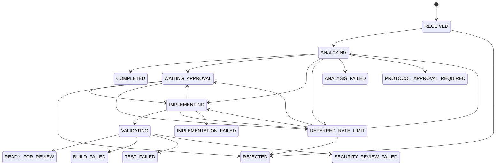

# SST-AX Task 상태 규약

이 문서는 SST-AX Task 상태의 사람이 읽는 기준 문서다. 기계 검증은
[`state/task-state.schema.json`](../state/task-state.schema.json)이 담당하고,
실제 허용되는 상태 전이(작업 상태 변경)는
[`scripts/update_task_state.py`](../scripts/update_task_state.py)의
`ALLOWED_TRANSITIONS`가 담당한다. 세 기준은 함께 변경해야 한다.

예를 들어 `RECEIVED → ANALYZING`은 접수된 작업이 분석 중으로 바뀌는 하나의
상태 전이다. 전이 순서는 어떤 상태로 이동할 수 있는지, 전이 조건은 이동 전에
승인·검증 등 어떤 근거가 필요한지를 뜻한다.

## 상태 흐름

`READY_FOR_REVIEW`는 SST-AX가 Draft PR을 준비한 뒤 사람의 review를 기다리는
자동화 종료 지점이다. PR merge 이후의 완료 여부는 SST-AX 상태 전이 범위가
아니다. `COMPLETED`는 SSTC 수정이나 Draft PR이 필요하지 않아 Task를 종료하는
경우에 사용한다.

## 상태 정의

| 상태 | 의미 | 자동화 동작 | 종료 여부 |
|---|---|---|---|
| `RECEIVED` | 입력이 접수된 초기 상태 | Task state와 log를 생성 | 아니오 |
| `ANALYZING` | 변경·요청의 영향과 위험도를 분석하는 중 | read-only 증적과 대상 저장소 지침을 수집 | 아니오 |
| `WAITING_APPROVAL` | 사람의 판단 없이는 진행할 수 없는 상태 | checkpoint와 승인 사유를 저장하고 실행을 멈춤 | 아니오 |
| `IMPLEMENTING` | 승인된 범위에서 SSTC를 수정하는 중 | 별도 worktree와 branch에서만 쓰기 수행 | 아니오 |
| `VALIDATING` | 구현 결과의 결정론적 검증을 수행하는 중 | 대상 저장소의 build/test/lint/security 검증 수행 | 아니오 |
| `READY_FOR_REVIEW` | 검증을 통과하고 Draft PR 검토를 기다리는 상태 | PR 정보와 검증 증적을 기록 | 예 |
| `COMPLETED` | SSTC 변경 없이 Task를 종료한 상태 | 종료 사유를 log에 기록 | 예 |
| `REJECTED` | 사람이 작업을 거부한 상태 | 실행을 중단하고 거부 사유를 기록 | 예 |
| `DEFERRED_RATE_LIMIT` | Codex 사용량 제한으로 중단한 상태 | checkpoint를 저장하고 busy-retry하지 않음 | 아니오 |
| `ANALYSIS_FAILED` | 신뢰할 수 있는 영향 분석을 만들지 못한 상태 | 증적을 보존하고 사람에게 에스컬레이션 | 예 |
| `IMPLEMENTATION_FAILED` | 승인된 구현을 완료하지 못한 상태 | 실패 출력과 마지막 checkpoint를 보존 | 예 |
| `BUILD_FAILED` | 빌드 검증에 실패한 상태 | 변경을 격리하고 실패 증적을 보존 | 예 |
| `TEST_FAILED` | 테스트 검증에 실패한 상태 | 변경을 격리하고 실패 증적을 보존 | 예 |
| `SECURITY_REVIEW_FAILED` | 보안 검토를 통과하지 못한 상태 | Draft PR을 만들지 않고 에스컬레이션 | 예 |
| `PROTOCOL_APPROVAL_REQUIRED` | SSTD protocol/contract 결정이 필요한 상태 | SSTC 구현을 중지하고 사람의 결정을 요청 | 예 |

실패 상태와 `PROTOCOL_APPROVAL_REQUIRED`는 자동 재개하지 않는다. 원인과
재개 조건을 확인한 뒤 별도 Task 또는 명시적으로 허용된 복구 절차를 사용한다.

Worker의 일시적인 timeout·중단·Codex 실패는 `IMPLEMENTING` checkpoint를 유지하고
누적 예산 안에서 재시도한다. 작업 공간 생성 실패·후보 범위 위반·세션 불일치·
이벤트 형식 오류는 `IMPLEMENTATION_FAILED`로 종료한다. 로컬 빌드 실패는
`IMPLEMENTING → VALIDATING → BUILD_FAILED`로 기록한다. 부모 프로세스 크래시로
`RUNNING`이 남으면 자동 재실행하지 않으며, 기록된 프로세스의 종료와 실제 누적
예산을 검증하는 [명시적 Worker 복구](sstc-worker.md)가 필요하다.

## 허용 전이

| 현재 상태 | 허용되는 다음 상태 |
|---|---|
| `RECEIVED` | `ANALYZING`, `REJECTED` |
| `ANALYZING` | `WAITING_APPROVAL`, `IMPLEMENTING`, `COMPLETED`, `DEFERRED_RATE_LIMIT`, `ANALYSIS_FAILED`, `PROTOCOL_APPROVAL_REQUIRED` |
| `WAITING_APPROVAL` | `IMPLEMENTING`, `REJECTED`, `DEFERRED_RATE_LIMIT` |
| `IMPLEMENTING` | `VALIDATING`, `WAITING_APPROVAL`, `DEFERRED_RATE_LIMIT`, `IMPLEMENTATION_FAILED` |
| `VALIDATING` | `READY_FOR_REVIEW`, `BUILD_FAILED`, `TEST_FAILED`, `SECURITY_REVIEW_FAILED` |
| `DEFERRED_RATE_LIMIT` | `ANALYZING`, `IMPLEMENTING`, `WAITING_APPROVAL`, `REJECTED` |
| 종료 상태 | 없음 |

`WAITING_APPROVAL`, `DEFERRED_RATE_LIMIT`, 모든 종료 상태는 `--reason`을
필수로 한다. 상태가 변경되면 `updated_at`을 갱신하고, 대응하는 task log에
`from_status`, `to_status`, 시각, 사유를 기록한다.

## 위험도와 상태의 관계

### CLI와 Controller 전이 조건

허용 전이 표는 필요조건이며, 다음 실행 조건도 충족해야 한다.

- `IMPLEMENTING`: CRITICAL은 금지한다. HIGH, `approval_reason`이 있는 작업,
  `WAITING_APPROVAL`에서의 진행은 검증된 Slack 승인이 필요하다. 일반 상태 CLI는
  이 경로를 거부하며 [Slack Gateway](slack-quickstart.md)만 인증된 응답을 적용한다.
  임의 승인 JSON은 받지 않는다.
- `READY_FOR_REVIEW`: 일반 상태 CLI는 전환을 거부한다. [SSTC pipeline](sstc-pipeline.md)이
  정책 허용 또는 승인된 구현·고정 후보 커밋·원격 검증·Draft PR receipt를 대조한 뒤 이 전이를 수행한다.
- `WAITING_APPROVAL`, `DEFERRED_RATE_LIMIT`: state/log snapshot과 재개 단계를
  checkpoint에 먼저 저장한다. 사용량 제한은 timezone이 있는 관측된 reset 시각을
  `--deferred-until`로 지정한다. 시각을 모르면 추정해서 실행하지 않는다.
- 대기 상태에서 진행할 때 checkpoint가 현재 state/log와 일치해야 한다.
  사용량 제한 후에는 reset 시각이 지난 뒤 checkpoint의 단계로만 재개한다.
  `REJECTED`는 reset을 기다리지 않고 종료할 수 있다.
- state/log의 task ID, 입력 출처, 상태가 다르면 진행하지 않는다.

이는 CLI의 진행 조건이며 OS 권한 격리를 대신하지 않는다. 로컬 상태 파일을
직접 수정할 수 있는 주체를 방어하는 인증 장치는 아니다. Controller 실행 정책은
검증된 분석의 위험도·승인 사유와 입력·결과·세션을 결합해 판정한다. 초기 위험도나
일반 상태 CLI의 성공만으로 Worker를 허용하지 않는다.

위험도는 현재 상태와 별개의 판단 값이다. 위험도가 높다고 상태를 임의로
변경하지 않으며, 정책에 따라 승인 대기 또는 작업 중단으로 전이한다.

| 위험도 | 기본 처리 |
|---|---|
| `NONE` | 분석 또는 제한된 자동 처리 |
| `LOW` | 자동 처리 가능, 검증 필수 |
| `MEDIUM` | 구현 후 Draft PR과 사람 review 필요 |
| `HIGH` | 구현 전에 Slack 승인 필요 |
| `CRITICAL` | AI는 제안만 작성하고 구현하지 않음 |

## 상태와 rollback

SST-AX는 SSTD `main`, Release, production에 직접 변경을 적용하지 않는다.
따라서 실패 시 원격 `main`을 rollback하는 대신, SSTC 작업을 별도 worktree와
branch에 격리하고 실패 증적·task log·checkpoint를 보존한다. 격리된 변경을
정리할 때도 먼저 필요한 diff와 로그를 보존해야 한다.
